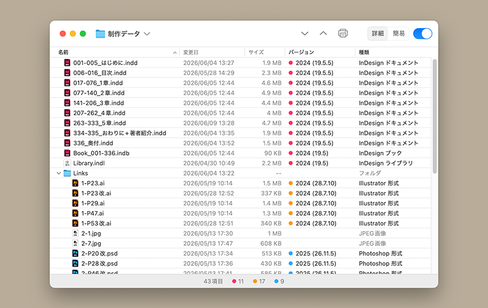

# AFVer Desktop

macOS用デスクトップアプリ

## 用途

AFVer Desktop は、InDesign や Illustrator のさまざまな形式のファイルを一つのリストに並べ、それぞれの作成バージョンを一度に確認できるユーティリティアプリです。どのファイルがどのバージョンで保存されたのかを一覧で見渡せます。

## 使い方

1. フォルダまたはファイルを、AFVer Desktop のウインドウ、または Dock アイコンにドラッグ＆ドロップします。
2. リストで表示されます。 ファイルのバージョンを確認します。
3. 必要に応じてサブフォルダを展開し、メニューやツールバーからプリントを行います。

詳細は、AFVer Desktop のヘルプメニュー「AFVer Desktop ヘルプ」を選択してください。

## 動作環境

macOS 13 Ventura 以降（Universal Binary）

## ライセンス

This project is licensed under the MIT License - see the [LICENSE](LICENSE) file for details.
